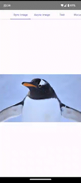
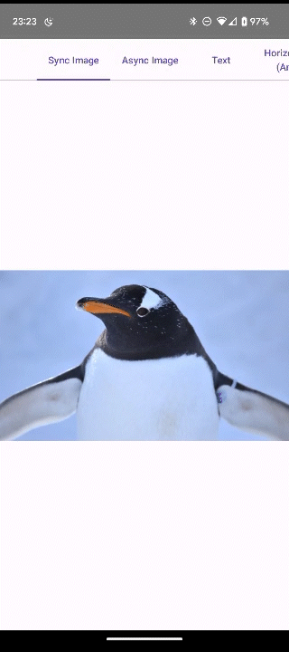
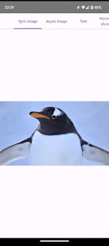
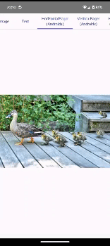
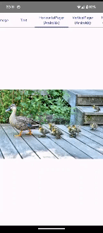
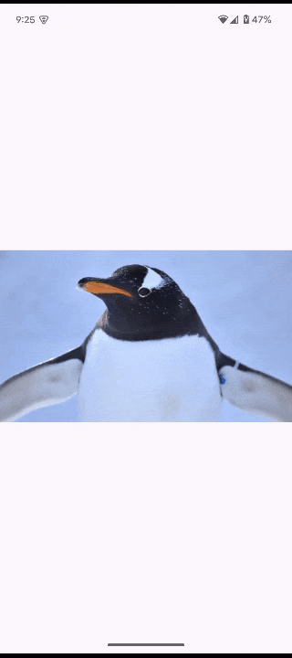

# Zoomable

Zoomable is a Compose Multiplatform library that enables the content zoomable by pinch gesture, double-tap, tap-and-drag gesture, or mouse scroll wheel.

|  |  |  |
|----------------------|-------------------------|------------------------------------|
| Pinch                | Double-tap              | Double-tap and drag                |

Zoomable provides a simple Modifier extension function `Modifier.zoomable`.

Here is the simplest sample code.
You can make image zoomable by just adding one line code.

```Kotlin
Image(
    painter = painterResource(id = R.drawable.penguin),
    contentDescription = null,
    modifier = Modifier.zoomable(rememberZoomState()),
)
```

Zoomable can be used with

- any composable components such as `Image`, `Text`, etc.
- asynchronous image composable such as coil's `AsyncImage`.

Zoomable also can be used in conjunction with `HorizontalPager` and `VerticalPager`.

## Platforms

Zoomable supports Android, iOS, and Desktop.

|Platform|Pinch|Double-tap|Tap-and-drag|Mouse scroll wheel|
|--|--|--|--|--|
|Android|✅|✅|✅|✅|
|iOS|✅|✅|✅|✅|
|Desktop|*1|✅|✅|✅|
|Wasm|✅|✅|✅|✅|

- ✅: Supported
- *1: Compose desktop does not support multi-touch gestures.

## API Reference

[API Reference🔎](https://usuiat.github.io/Zoomable/)

## Usage

### Download

Zoomable is available on Maven Central.

```
repositories {
    mavenCentral()
}

dependencies {
    implementation "net.engawapg.lib:zoomable:$version"
}
```

The latest version: 

### Basic Usage

You can use `Modifier.zoomable` to make contents such as an image zoomable.
The zoom state is managed in a `ZoomState` object that can be created via `rememberZoomState`.
If `contentSize` is set, the range of offset will be optimized for the specified size.

```Kotlin
val painter = painterResource(id = R.drawable.penguin)
val zoomState = rememberZoomState(contentSize = painter.intrinsicSize)
Image(
    painter = painter,
    contentDescription = "Zoomable image",
    contentScale = ContentScale.Fit,
    modifier = Modifier
        .fillMaxSize()
        .zoomable(zoomState),
)
```

### Double tap action

By default, every time double tap is detected, `zoomable` modifier switches the scale between 1.0f and 2.5f.

To change the scale set for double-tap detection, call `toggleScale` with desired value in `onDoubleTap` callback.

```Kotlin
val targetScale = 5.0f
zoomable(
    zoomState = zoomState,
    onDoubleTap = { position -> zoomState.toggleScale(targetScale, position) }
)
```

If you want to implement the logic to determine the scale value yourself, you can use the `changeScale` function.
In the example below, the scale is switched in three steps.

```Kotlin
zoomable(
    zoomState = zoomState,
    onDoubleTap = { position ->
        val targetScale = when {
            zoomState.scale < 2f -> 2f
            zoomState.scale < 4f -> 4f
            else -> 1f
        }
        zoomState.changeScale(targetScale, position)
    }
)
```

To disable double tap action, set empty function to `onDoubleTap`.

```Kotlin
zoomable(
    zoomState = zoomState,
    onDoubleTap = {}
)
```

### One finger zoom

By default, one finger zoom action, tap followed by vertical drag, is enabled.
If you want disable it, set false to `enableOneFingerZoom`.

```Kotlin
zoomable(
    zoomState = zoomState,
    enableOneFingerZoom = false,
)
```

### ScrollGesturePropagation

You can choose when to propagate scroll gestures to the parent Pager composable by specifying `scrollGesturePropagation`.

- `ContentEdge`: Scroll gesture is propagated when the content is scrolled to the edge and attempts to scroll further.
- `NotZoomed`: Scroll gesture is propagated when the content is not zoomed.

|  |  |
|---------------------------------------------------|-------------------------------------------------|
| ContentEdge                                       | NotZoomed                                       |

### Mouse Scroll Wheel

By default, zooming works by holding down the Ctrl key and operating the mouse wheel.
This is intended to be used primarily with desktop and web, but it also works with Android and iOS.
You can change the behavior by using the `mouseWheelZoom` argument of `zoomable`.

- `Disabled` disables zoom by mouse wheel operation.
- `Enabled` enables zoom by mouse wheel operation regardless of whether the modifier key is pressed.
- `EnabledWithCtrlKey`, `EnabledWithShiftKey`, `EnabledWithAltKey`, and `EnabledWithMetaKey` enable zoom by mouse wheel operation while holding down the modifier key.

### Snap Back Zoom

`Modifier.snapBackZoomable` allows you to zoom an image with a pinch gesture and automatically return it to its original size when you release your finger.
You can easily achieve Instagram-like behavior.



### Zoom with Scroll Component

To zoom a component that itself scrolls, such as a `LazyColumn` or `LazyRow`, use `zoomableWithScroll`.

> [!WARNING]
> `zoomableWithScroll` is an experimental API and may change in the future.

```Kotlin
LazyColumn(
    modifier = Modifier.zoomableWithScroll(rememberZoomState())
) {
    items(100) { Text("Item $it") }
}
```

It can also be used with `Modifier.verticalScroll` or `Modifier.horizontalScroll`.
In that case, put `zoomableWithScroll` before `verticalScroll` or `horizontalScroll` in the Modifier chain.

```Kotlin
Column(
    modifier = Modifier
        .fillMaxSize()
        .zoomableWithScroll(rememberZoomState())
        .horizontalScroll(rememberScrollState())
) {
    repeat(100) { Text("Item $it") }
}
```

## Samples

You can try [sample app](./composeApp/) that contains following samples.

- Standard Image composable ([source](composeApp/src/commonMain/kotlin/net/engawapg/app/zoomable/BasicSample.kt))
- Asynchronous image loading using [Coil](https://coil-kt.github.io/coil/) library ([source](composeApp/src/commonMain/kotlin/net/engawapg/app/zoomable/CoilSample.kt))
- Image on `HorizontalPager` ([source](composeApp/src/commonMain/kotlin/net/engawapg/app/zoomable/PagerSample.kt))
- Snap back zoom ([source](composeApp/src/commonMain/kotlin/net/engawapg/app/zoomable/SnapBackSample.kt))
- `LazyColumn` ([source](composeApp/src/commonMain/kotlin/net/engawapg/app/zoomable/LazyColumnSample.kt))
- Row with `Modifier.horizontalScroll` ([source](composeApp/src/commonMain/kotlin/net/engawapg/app/zoomable/ScrollableRowSample.kt))

## License

Copyright 2022 usuiat

Licensed under the Apache License, Version 2.0 (the "License");
you may not use this file except in compliance with the License.
You may obtain a copy of the License at

http://www.apache.org/licenses/LICENSE-2.0

Unless required by applicable law or agreed to in writing, software
distributed under the License is distributed on an "AS IS" BASIS,
WITHOUT WARRANTIES OR CONDITIONS OF ANY KIND, either express or implied.
See the License for the specific language governing permissions and
limitations under the License.
